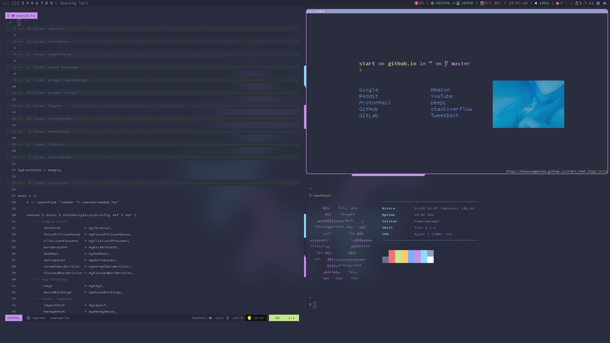

\
<p align="center">
home-manager + xmonad + neovim💛
</p>
\
\
\



\
\
[](https://nixos.org/)
[](https://neovim.io/)
[](https://xmonad.org/)
\


<h1 align="center">
NixOS configuration
</h1>

\
note: this repo is a personally backup. and my system is still work in
progress.\
I try to install packages/manage config files declarative using
`configuration.nix` and `home.nix` as much as possible.\
I personally use vim\'s folding(marker) to make config files readable.\
If you are new to nixos, maybe you can get idea how to install neovim
plugins and fish plugins,haskell packages,python packages from this
config.\

Installation
------------

\
I don\'t recommend installing this config. but you can try if you want.
It\'s hardcoded now in several places to use `/home/btw/.nixconfig.` so
you have to use as it is or change username. You need to have `git`
installed and you have to be on nixos-stable. You have to change
hardware configurations.
```bash
git clone https://github.com/btwiusegentoo/nixconfig
/home/btw/.nixconfig ln -s /home/btw/.nixconfig/configuration.nix /etc/nixos/configuration.nix
```
home-manager is configured as module so channel is not needed anymore.\

Summary of Features
-------------------

\

-   home-manager
-   xmonad+xmobar
-   neovim nightly + plugins(includes coc)
-   haskell environment
-   Japanese IME(mozc+fcitx)
-   Keybinds optimized for Dvorak layout and HHKB
-   Alacritty
-   qutebrowser
-   fish shell + plugins
-   Tamzen bitmap font as main font
-   NerdFont as fallback(GohuFont)
-   Apple emoji
-   Apple SF fonts installed
-   Some packages from unstable while running stable branch
-   It assumes you are using 1080p and scales to WQHD. You will want to
    disable if you are using other resolution. You can find in home.nix
    (xsession.profileExtra) If you will change resolution, I think you
    will also want to change font sizes.

Credits
-------

[NixOS/nixos-artwork](https://github.com/NixOS/nixos-artwork/tree/master/logo)
-\> NixOS logo. used on wallpaper. Just changed colors. used under
[CC-BY license](https://creativecommons.org/licenses/by/4.0/)
